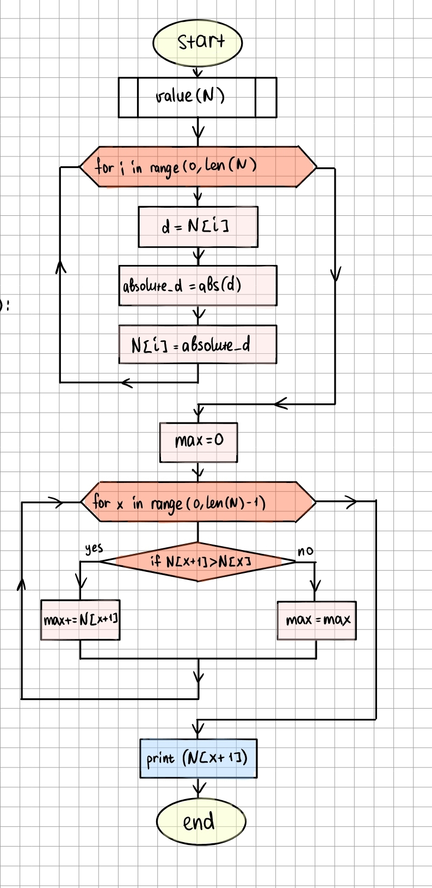

```.py

def value(N):
    for i in range(0, len(N)):
        d = N[i]
        absolute_d = abs(d)
        N[i] = absolute_d
    max = 0
    for x in range(0, len(N)-1):
        if N[x+1]>N[x]:
            max+=N[x+1]
        else:
            max = max
    print(N[x+1])

value([-100,5,7,-200])

```


