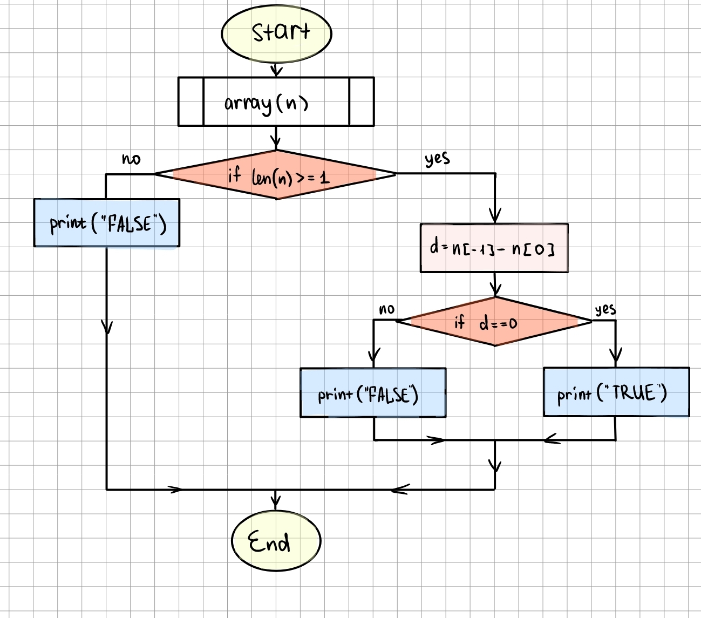
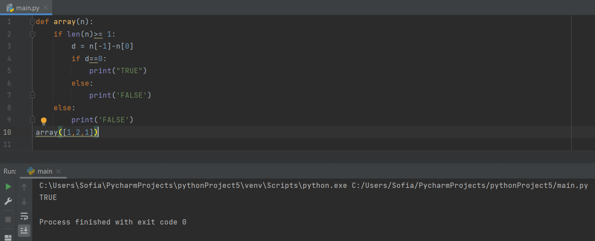

```.py
def array(n):
    if len(n)>= 1:
        d = n[-1]-n[0]
        if d==0:
            print("TRUE")
        else:
            print('FALSE')
    else:
        print('FALSE')
array([1,2,1])

```


